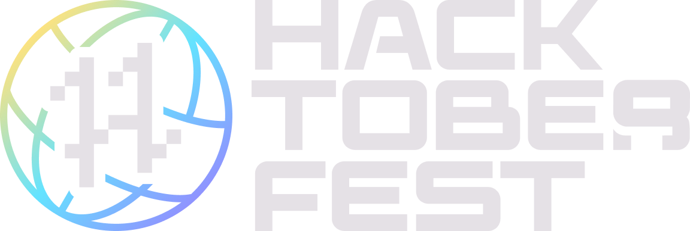

<h1 align="center">  HacktoberFest 2022  </h1>

   

<h4> You can make folders of any programming languages and add code in that folder to contribute in this Repo (You can do PR more than one in this Repo by adding more folders), also you can contribute in the repo's mentioned below</h4>

<h4> Feel free to contribute to this repo by creating and editing little programs in any programming language and make different folders for the code you want to contribute. </h4>

If you want to practice to make a pull request, follow the [CONTRIBUTING.md](/CONTRIBUTING.md)

 

> You can also contribute in the following repo's :-

| Repository  | Issues  | Pull Requests  | Forks |
|---|---|---|---|
| [Swags for Developers](https://github.com/MrKrishnaAgarwal/Swags-for-Developers) |   |   |  |
| [Drone Course](https://github.com/MrKrishnaAgarwal/Drone-Course) |   |   |  |
| [Git Cheat Sheet](https://github.com/MrKrishnaAgarwal/Git-CheatSheet) |   |   |  |  
| [Hello World](https://github.com/MrKrishnaAgarwal/Hello-World) |   |   |  |
| [Python Guide](https://github.com/MrKrishnaAgarwal/Python-Guide) |   |   |  |
| [30 Days of Code](https://github.com/MrKrishnaAgarwal/30DaysOfCode) |   |   |  |
 

### Author

* **Avinash Kumar**
* [Linkedin](https://www.instagram.com/coder_avi/)
* [GitHub](https://github.com/CoderAvi)
* [Website](https://coderavi.github.io/my-protfolio/)
* [Email](mailto:kumaravinash4699@icloud.com)

### Contributing

Please read [CONTRIBUTING.md](/CONTRIBUTING.md) and [CODE_OF_CONDUCT.md](/CODE_OF_CONDUCT.md) for details on our code of conduct, and the process for submitting pull requests to us.

### Rules

* Read the [CONTRIBUTING.md](/CONTRIBUTING.md) file.
* Respect people.
* Be friendly, helpful, and patient.
* You can contribute in any way.

### Support

If you like this project, please consider supporting it by giving it a ⭐️. It will help us to grow and improve this project and help others to find it.

### Conclusion

- Happy Contributing! 🎉 
- May you have a great Hacktoberfest 2022! 🎉
- If you have any questions, feel free to ask me. I will be happy to help you. 😊

### References

- [Hacktoberfest 2022](https://hacktoberfest.digitalocean.com)
- [Hacktoberfest 2022 Participation Guidelines](https://hacktoberfest.com/participation)

 

- This project and other projects listed above are a part of Hacktoberfest 2022 and are open to all members of the GitHub community. Any member may contribute to these projects without being a collaborator or a maintainer and earn a T-shirt from DigitalOcean and DEV by making four valid pull requests (PRs) between October 1-31 (in any time zone).

- The first 40,000 participants (maintainers and contributors) who complete Hacktoberfest can elect to receive one of two prizes: a tree planted in their name, or the Hacktoberfest 2022 t-shirt.

## Feedback

Your feedback is appreciated. Please fill out this [form]() to share your feedback and suggestions, or create an issue.
